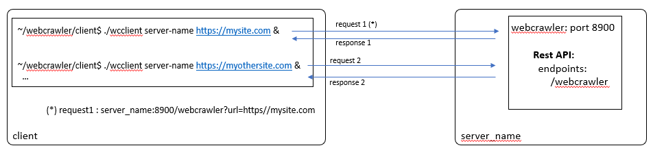
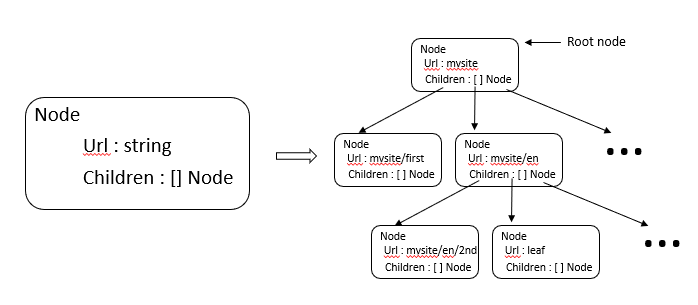

# WEBCRAWLER
# Introduction 
I made some implementation choices (generally commented in the code),  for 
example the root url passed to the server must be a full url 
http[s]//base_site (e.g. http[s]:// is mandatory). 

As asked in the instructions, all found linked that are not under 
the base url are considered as leafs (so they appear in the displayed sitemap, 
but we don't follow these links). It obviously avoids scanning the entire internet :) 

Only simple unit tests for utils package (for demonstration purpose) have been developed 
(for  other packages, some mock should be written in order to develop relevant unit tests) 

The initial version of the webcrawler (***basic*** git tag) was a naive approach based 
on a recursive algorithm to compute sitemap. 
In later versions, in order to improve performance and avoid stack overflow issues, I get rid of 
recursion to compute the sitemap and I also rely on concurrent goroutines to improve performance. 

> **Note** : I realized while reading again instructions before submitting my results that it 
>  would be preferable to have a server able to handle multiple requests in parallel. My initial choice was to 
> implement a server that handle only one request at a time. 
> Thus I have adapted the code in last version (tag 6.0) to handle multiple requests 
> (5.0 tag is the single request version)  
> In this final release there was still place for improvements, for example we could add logging capabilities
> to be able to enable or disable debug log to investigate issues. We could also improve the usability 
> of bothe server and client by adding configuration file and/or env variables and also expose a pretty command 
> line (we could rely on viper and cobra packages for that purpose).

## Basic explanations 
### Server
The webcrawler server exposes a very simple Rest API, with one single endpoint allowing to 
compute the sitemap of the provided base url (provided in client request parameters).
Basically it could be represented as follows :



For the sake of simplicity the server listen on port 8900 (but it coud be controlled either by a config parameter or
by a parameter passed at server laubch time)

In order to improve performance and reliability, I don't rely on a recursive algorithm to compute the sitemap, 
though it seems the natural approach. The server computes concurrently the sitemap using goroutines (Could be seen as 
worker threads). I limited the number of workers to 20 but once again it could be very easily configurable via a config 
parameter. 

### Data structure
The data structure to store the site map is really simple (see schema below).
It logically represents a tree and thus consists on a chained struct
where each node represents an url of
the sitemap and contains a list of children nodes (representing
its different child urls). 



## Setup 
Linux based instructions
```bash
~> git clone https://github.com/pat38webcrawler/webcrawler.git

~> cd webcrawler

# set  GOPATH accordingly 
# check PATH and GOROOT variables
 
# get required packages 
~> go get -t -v github.com/julienschmidt/httprouter
~> go get -t -v github.com/justinas/alice
~> go get -t -v github.com/pkg/errors
~> go get -t -v golang.org/x/net/html
```
## Build client and server 

In webcrawler directory 
```bash
~> go build -o webcrawler 
~> cd client 
~> go build -o wcclient 
~> cd ..

# to run unit tests (still in webcrawler directory)
~>  go test ./... 
```

## Launch server and lauch a request using client 
In a first terminal 
```bash
~> cd <webcrawler dir> 
# start the webcrawler server. It will start the server on localhost. Server listen on port 8900
~> ./webcrawler  
2022/02/26 7:56:59 Starting HTTPServer on address [::]:8900   
```
In another terminal go to webcrawler/client directory
```bash 
~> cd webcrawler/client
# launch the client to send a request to the server

~> ./wcclient localhost 8900 https://<your_site> 
```

> **Note** : After reading again the instructions  it was not totally clear for me 
> if we need to compute the site map under the provided url or the full sitemap of the "root" site containing 
> the provided url. Thus I choose to make it configurable (if full=true is provided in request parameter of the request 
> or ***full*** is provided as the last parameter of the wcclient then this option is activated). So for example 
> if you provide "https://mysite.com/foo" as root url, and if you run : 
> 
> ~> wcclient localhost 8900 https://mysite.com/foo **full** 
>
> then the whole site map under  https://mysite.com will be returned, otherwise if you don't pass the **full** parameter
> 
> ~> wcclient localhost 8900 https://mysite.com/foo
> 
> only the sitemap under https://mysite.com/foo will be returned

## Build a simple docker image 
This simple image will allow to run our webcrawler server in a docker 
container. This is a first step towards deploying our app in a K8s 
environment

> **Note**:
I use a local private docker registry (node1:5000) to illustrate this example, but you can tag the built image as you 
> want in order to push it under any registry you have access.

The **Dockerfile** is available under webcrawler directory 
```bash
# go to webcrawler dir
~> cd <webcrawler>
~> docker build -t node1:5000/webcrawler:latest . 
~> docker push node1:5000/webcrawler:latest 

# then you can start our server in a container 
~> docker run -p 8900:8900 -d node1:5000/webcrawler
```
## Deployment  on a K8S cluster (tested on a k3s distribution)
> **Note**: I initially planned to use microk8s distribution, but I faced some limitations 
> to install it on WSL2 environment on my laptop (snap not available...). I investigated these issues and made some 
> progress. After some workarounds I was able to use snap on WSL2, but still the microk8s installation failed (controller 
> didn't start). Due to lack of time I decided to rely on k3s distribution which is simpler to install.
> 
>I used latest stable k3s distrib: "k3s version v1.22.6+k3s1"

The **webcrawler.yaml** file contains the different resources needed to deploy my webcrawler container on the k3s cluster.
Basically I created  a service to expose the webcrawler app running in a pod. I also configured an ingress to be 
able to send requests from outside. In this simple example, I only deploy 1 replica for the webcrawler pod, but number of 
replica could be increased (for high availability purpose or to scale the configuration to handle more requests).
Another choice should be to rely on a load balancer to hande the client traffic on the different deployed webcrawler replicas.
I had a quick look but don't find an easy way to setup a load balancer with the k3s rancher distribution. 

The content of the deployment yaml file is :
```
apiVersion: apps/v1
kind: Deployment
metadata:
  name: webcrawler-deployment
  namespace: webcrawler-demo
spec:
  replicas: 1
  selector:
    matchLabels:
      app: webcrawler
  template:
    metadata:
      labels:
        app: webcrawler
    spec:
      containers:
        - name: webcrawler
          image: patduc/demo:webcrawler
          resources:
            requests:
              memory: "64Mi"
              cpu: "100m"
            limits:
              memory: "128Mi"
              cpu: "500m"
          ports:
          - containerPort: 8900
          imagePullPolicy: Always
---
apiVersion: v1
kind: Service
metadata:
  name: webcrawler-service
  namespace: webcrawler-demo
spec:
  ports:
  - port: 80
    targetPort: 8900
    name: tcp
  selector:
    app: webcrawler
---
apiVersion: networking.k8s.io/v1
kind: Ingress
metadata:
  name: webcrawler-ingress
  namespace: webcrawler-demo
  annotations:
    kubernetes.io/ingress.class: "traefik"
spec:
  rules:
  - http:
      paths:
      - path: /
        pathType: Prefix
        backend:
          service:
            name: webcrawler-service
            port:
              number: 80
```
> I have preliminarily pushed my webcrawler docker image in a dockerhub repository ***patduc/demo:webcrawler***
I also wanted to try with a local unsecured registry by modifying the rancher ***registries.yaml*** file, but 
I faced some issues (k3s try to access the registry as a secured one though it is unsecured. It was probably a 
configuration mistake on my side, but I didn't push the investigation deeper to save time)

In order to deploy the different elements I ran the following commands 

```bash
# Create a dedicaated namespace
~> kubectl create namespace webcrawler-demo

#  deploy service and webcrawler pod
~> k3s kubectl apply -f webcrawler.yaml
deployment.apps/webcrawler-deployment created
service/webcrawler-service created
ingress.networking.k8s.io/webcrawler-ingress created

# check service and pod are running 
~> k3s kubectl get ingress,svc,pods -n webcrawler-demo
NAME                                           CLASS    HOSTS   ADDRESS      PORTS   AGE
ingress.networking.k8s.io/webcrawler-ingress   <none>   *       10.0.0.161   80      32m26s

NAME                         TYPE        CLUSTER-IP      EXTERNAL-IP   PORT(S)   AGE
service/webcrawler-service   ClusterIP   10.43.240.114   <none>        80/TCP    32m26s

NAME                                         READY   STATUS    RESTARTS   AGE
pod/webcrawler-deployment-64f74bd9bb-m2cq9   1/1     Running   0          32m26s
```

Finally, I was able to  run a request using our client

```bash
~> ./wcclient 10.197.138.254  80  https://access.redhat.com/products/
https://access.redhat.com/products/
  - https://access.redhat.com/products/#pfe-navigation
    - https://access.redhat.com/products/#cp-main
    - https://access.redhat.com/management/
    - https://access.redhat.com/downloads/
    - https://catalog.redhat.com/software/containers/explore/
    - https://access.redhat.com/support/cases/
    - https://access.redhat.com/
    ...
```
